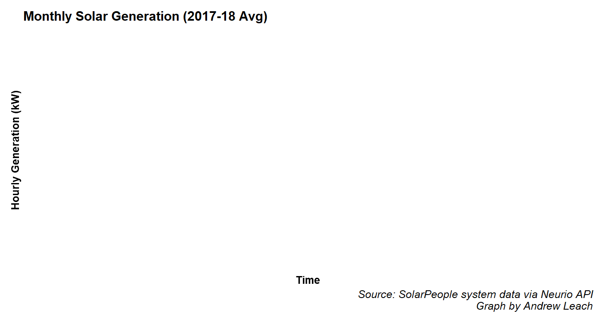
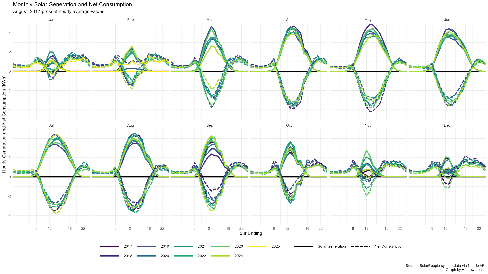

```{r setup, include=FALSE}
knitr::opts_chunk$set(echo = FALSE)
```


### How did we come to install solar power?
- I gave my students an assignment each year on installing solar using my own house and family as the 'clients'

- I got updated quotes each year (Thanks, Kyle Kasawski!)

```{r, fig.width = 2}
# Small fig.width
knitr::include_graphics("mini_case.png")
```
---


### How did we come to install solar power?
- Each year, students would reliably find that it didn't make financial sense

- In 2017, one group explained that, if a solar power system would generate a cup of coffee per day of nerd value, it would have a 20% rate of return

```{r, fig.width = 2}
# Small fig.width
knitr::include_graphics("mini_case.png")
```
---

### How did we come to install solar power?
- Each year, students would reliably find that it didn't make financial sense

- In 2017, one group explained that, if a solar power system would generate a cup of coffee per day of nerd value, it would have a 20% rate of return

```{r, fig.width = 2}
# Small fig.width
knitr::include_graphics("solar_cover.png")
```
---


### How much did it cost?
```{r, fig.width = 2}
# Small fig.width
knitr::include_graphics("solar_people_quote.png")
```
- Total system cost (installed) was $18,900 or $2.50 per watt

- Rebate from Energy Efficiency Alberta covered 30%, or $5670

- Our total cost (installed) was $13,230, or $1.62 per watt

---

### How much does it generate?
```{r, fig.width = 2}
# Small fig.width

```

- Expected generation was 9000kWh in year 1, and we got 9724kWh

- Should expect 0.5% annual degredation, so a 25 year lifetime should yield about 210,000 kWh of electricity

---

### Do you generate as much as you consume?
```{r, fig.width = 2}
# Small fig.width

```

- Yes. We ended up at net zero almost exactly in year 1

- We need to do a lot less laundry or we won't be there again in year 2


---

### Does this mean you could be off-grid?
```{r, fig.width = 2}
# Small fig.width

```

- No. Edmonton has great solar in the summer, but not much in the winter

- Moving that much power from summer to winter would require millions of dollars worth of batteries and a lot more generation to offset battery losses.


---

### Winter vs Summer

- We get fantastic solar in the spring and summer, not so much in January

```{r, fig.width = 2}
# Small fig.width

```


---

### Fun with your solar power system

- Watch an eclipse from your basement!

```{r, fig.width = 2}
# Small fig.width

```


---

### Fun with your solar power system

- Check whether shoveling snow matters!

```{r, fig.width = 2}
# Small fig.width

```

---

### Fun with your solar power system

- Check whether shoveling snow matters!

```{r, fig.width = 2}
# Small fig.width
knitr::include_graphics("snow_panels.png")
```

---

### Fun with your solar power system
- See how wildfire smoke compares to an eclipse!

```{r, fig.width = 2}
# Small fig.width

```


---
### Alright Mr. Economist, show me the money

```{r, fig.width = 2.5}
# Small fig.width
knitr::include_graphics("show_me_the_money.png")
```

---
### Alright Mr. Economist, show me the money

- Two main sources of savings: avoided transmission and delivery costs and sales back to the grid of excess power

- Meter measures receipts (power sent to the grid) and deliveries (power purchases)

```{r, fig.height= 0.5}
# Small fig.width
knitr::include_graphics("power_meter.png")
```

---
### Alright Mr. Economist, show me the money
- A typical day at home involves a lot of intermittent power use
```{r, fig.height= 1.5}
# Small fig.width

```

---
### Alright Mr. Economist, show me the money
- Power generation tends to be more predictable but isn't always greater than use
```{r, fig.height= 1.5}
# Small fig.width

```


---
### Alright Mr. Economist, show me the money
- So, on any given day, we're delivering power some minutes and selling it others
```{r, fig.height= 1.5}
# Small fig.width

```

---
### Alright Mr. Economist, show me the money

-transmission and distribution costs are charged on power deliveries
-power prices (same price all month long) paid on deliveries and rebated for sales

```{r, fig.height= 1.5}
# Small fig.width

```


---
### Alright Mr. Economist, show me the money

- Special pricing for solar microgenerators in the summer months improves things
- I used Alberta Cooperative Energy, but other providers offer a similar plan

```{r, fig.height= 1.5}
# Small fig.width

```


---

## What's the payback? Where your students correct?

- At current and expected future power prices and other variable charges, I'll capture about a 0.5% rate of return

- If microgeneration premia continue to be available, in addition to future energy and transmission prices, I'll capture about a 3.5% rate of return

- If microgeneration premia continue to be available, in addition to future energy and transmission prices, and you account for a cup of coffee per day in nerd value, I'll capture about a 14.5% rate of return

- No question they were correct - I've already gotten enough enjoyment out of it to eliminate any potential losses from the investment


```{r panel_degredation, echo = FALSE,include=FALSE}
#df<-data.frame(year=seq(0,24,1))
#df$degredation<-(1-0.005)^(1+df$year)
#df$gen<-9000*df$degredation
#13230/sum(df$gen)
#source("../mortgage.R")
#mortgage(P=13230,I=10,L=25,plotData = F,silent = T)[2]/sum(df$gen)
```

---
### Solar Generation


---
### Power Prices


---
### Pool Price Capture


