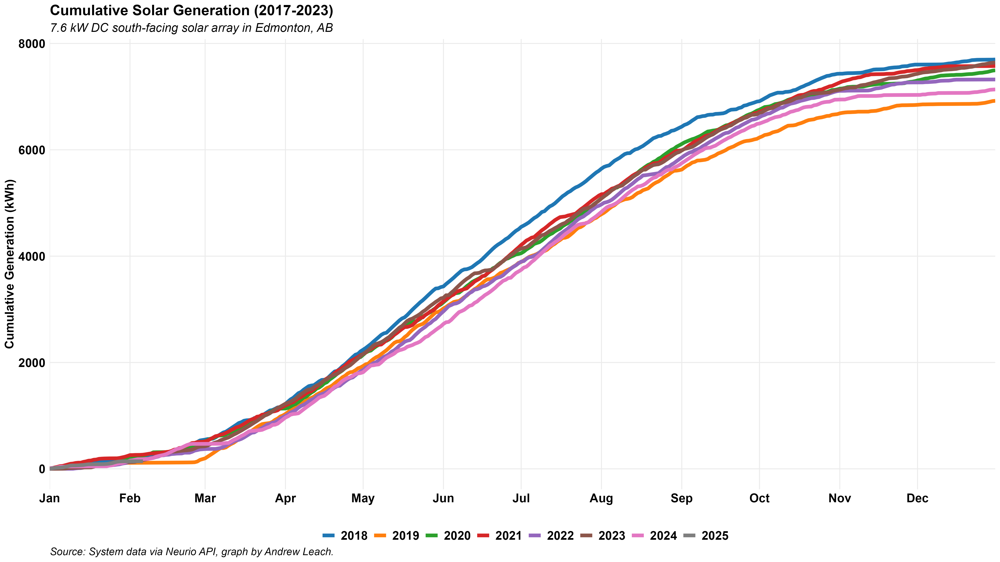
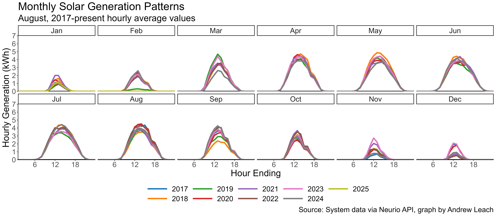
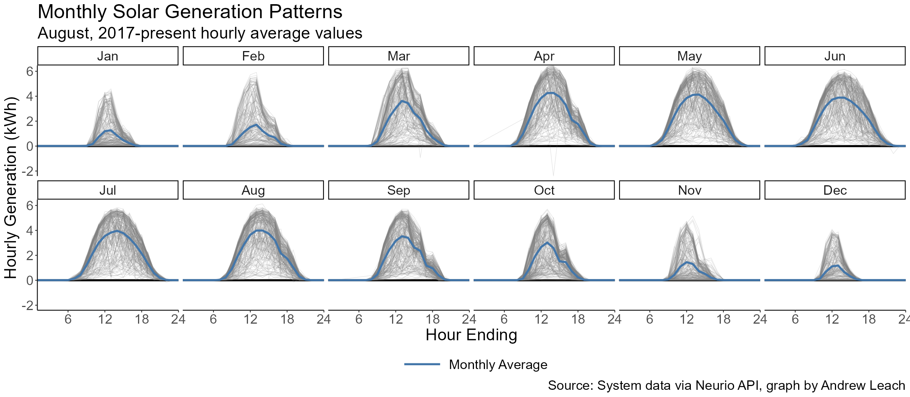
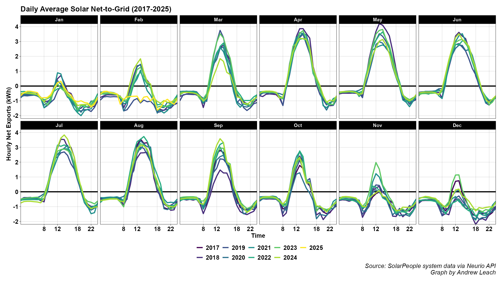
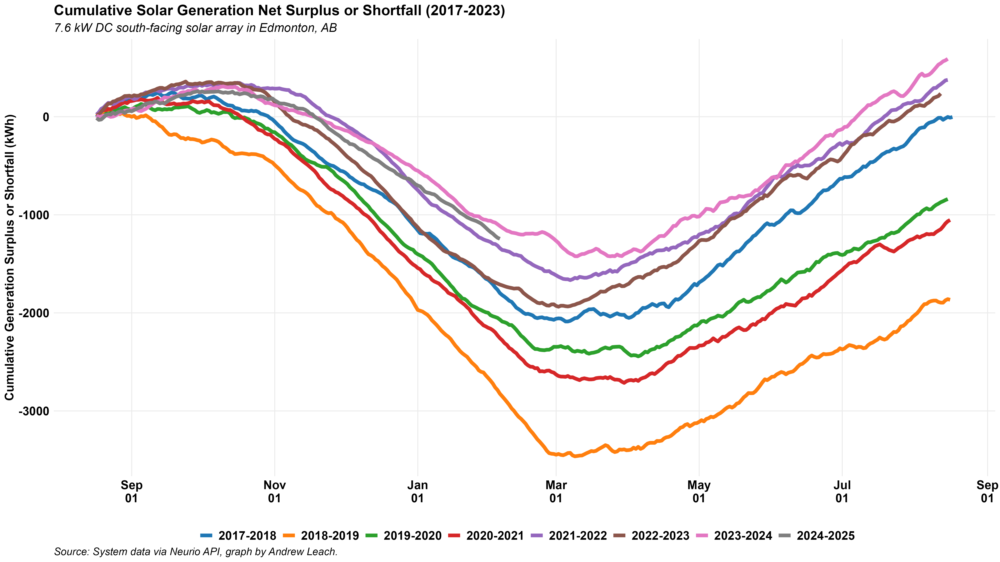
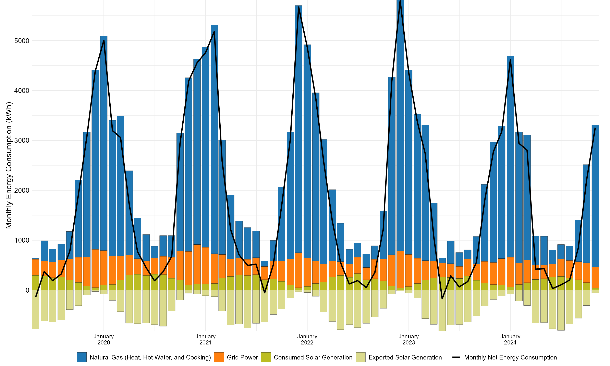
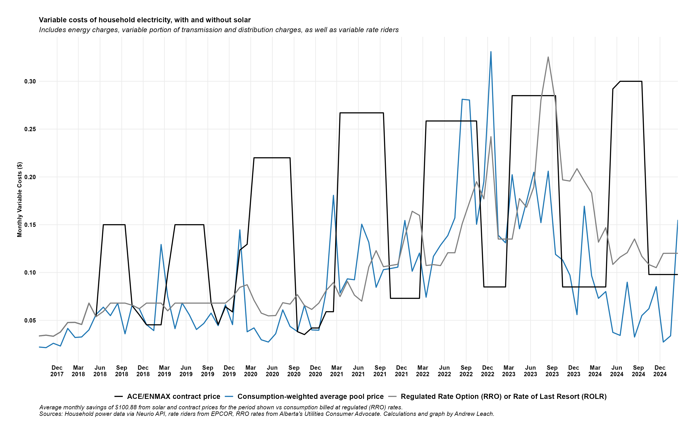
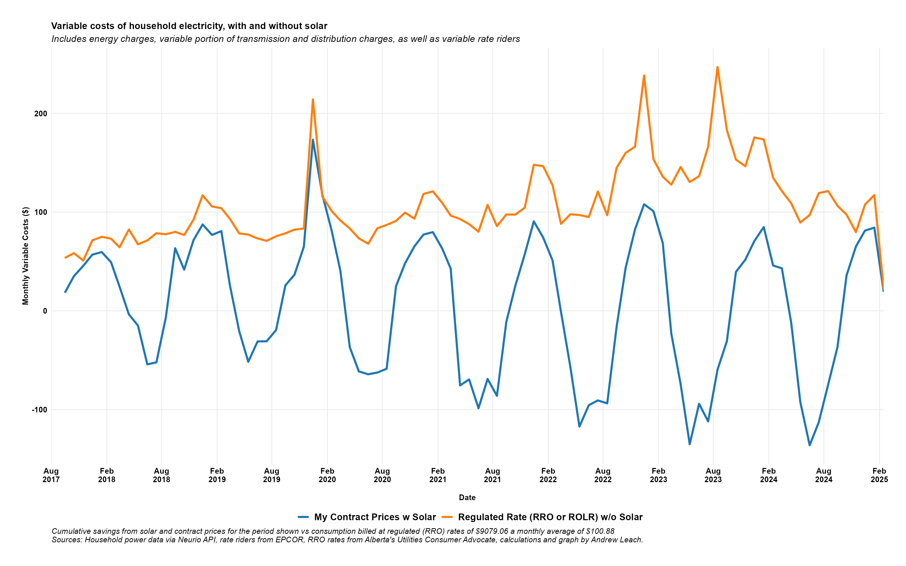

<a href="banner.png" target="_blank">
  
</a>

```{r prelims,message=FALSE,warning=FALSE,echo=FALSE,include=FALSE}
library(tidyverse)
library(lubridate)
knitr::opts_chunk$set(echo=FALSE,message=FALSE,warning=FALSE)

```


```{r load data,cache=FALSE,message=FALSE,warning=FALSE,echo=FALSE,include=FALSE}
load_file<-"hourly_solar_data.RData"
load(load_file,.GlobalEnv) 
```


On August 16, 2017, our 7.6kW household solar project (shown above) was fully connected to the EPCOR grid and we began using solar power and delivering excess energy to the grid. From that day though `r format(Sys.time(), '%B %d, %Y')`, we've generated `r format(sum(hourly_data$generationEnergy)/1000,nsmall=2)`MWh of energy, equivalent to `r format(sum(hourly_data$generationEnergy)/sum(hourly_data$consumptionEnergy)*100,nsmall=0)`% of our electricity consumption. With `r round(time_length(difftime(Sys.Date(),ymd("2017-08-16")),"years"),0)` years of data collected from our solar power system to this point, we have enough information for a really solid evaluation of the investment and, when combined with current information about solar costs and power prices, we can say a lot about the viability of residential solar in the Edmonton market.

## The initial investment

Our solar panels were installed when rebates were available from the provincial government, and so our system cost was reduced by about one third to $13,200. At the time, the installer's estimate was that we would see a nominal rate of return on the investment (over 27 years) of 5.59%, although my own estimates were lower than that. My own modelling suggested that we'd come closer to a zero real rate of return, with a nominal return approximately equal to our mortgage interest rate.


```{r, out.width = "500px",fig.align="center",dpi=300}

```


## Why did you install solar?

Funny story. I used to use my household as a *case study* for my University of Alberta energy economics students where, as part of the assignment, I would ask them to evaluate a potential solar installation. Since this required them to learn about electricity rate design, solar potential, consumption load profiles, and such, it was a great assignment. The kicker was that I told them that if any of them could convince me it was a good investment, I would actually consider doing it.

In 2017, one group of students presented their analysis that concluded that, on electricity value, my rate of return would be close to zero (similar to my own calculations at the time), but that if I thought I would get more than a cup of coffee per day worth of *nerd value* from having solar on my house, that would bring the return closer to 20%. My students knew their client, and made use of the economics concept of non-market benefits. That was enough for me: we made the call and booked an installation.


## How has the generation worked out?

```{r, out.width = "250px",fig.align="center"}

```


Our installation is an *Edmonton-south*-facing array (it's a little off due south) and we have a garage roof that was optimized for solar installation. We are almost fully unobstructed, except for two spruce trees which affect our generation a bit in the shoulder seasons. The total generation for the year has varied between 6.5 and 8MWh, which is a pretty wide range. This is a bit more than 10% below our quoted generation of 9030kWh per year (thanks, spruce trees), although that's not that surprising since we were pretty early adopters in Edmonton.

```{r, out.width = "800px",fig.align="center",dpi=300}

```

## Does the sun shine at night?

The generation patterns (of course) follow the sun, so we get more generation in the summer months due to both higher solar intensity and longer days. We've only really had one month where the panels were really socked-in, and that was in February of 2019 when a heavy, wet snow froze on the panels and a cold spell lasted much of the month. Otherwise, as you can see, December and January tend to be pretty weak months. We never clear our panels in the winter, but the roof has enough slope that the snow slides off once the sun comes out, as long as it's not well below -20. 

```{r, out.width = "800px",fig.align="center",dpi=300}

```


The month-year averages hide a lot of variability in daily generation, so here's a spaghetti plot with all of the individual days, overlaid with the system-life average for each month.

```{r, out.width = "800px",fig.align="center",dpi=300}

```

In both of these plots, you can see the impact of my neighbours' spruce trees, in October and November in particular.

## How does solar generation correlate with your household load?

One of the challenges with solar is that, while it does decrease your load on average, it is unlikely to alter your peak loads much at all. For example, our household peak load at the 5 minute or hourly level (that's as granular as I have the data) is the basically the same as our household peak consumption and many of our peak consumption hours occur in periods with low solar generation. Since we heat with gas and we don't have air cooling load, this discrepancy may not be representative for all houses.

I do think it's interesting to see how net consumption (or exports to the grid) vary through the months of the year, both on average (blue) and looking at the spaghetti plot of all the daily data in my sample.

```{r, out.width = "800px",fig.align="center",dpi=300}

```


## Have you made it to net-zero electricity?

We designed the system with net-zero electricity in mind, and we have made some changes in our house to reduce our electricity use since the system was installed. On the whole, we've reduced our electricity use by about as much as the shortfall in predicted solar generation, so we've come out pretty close to net zero overall. We had a couple of years in which we were really short, in part due to all of us being at home for so much of 2020-2022, so we're unlikely to claw all of that back. But for the first full year, and the most recent two of six years, we've generated more electricity than we've used. In the first year, we made it to net zero, but barely, just a few watt-hours!

```{r, out.width = "800px",fig.align="center",dpi=300}

```


## What about total household energy use?

We use natural gas for both space heat and domestic hot water and, as some of you will know, I have a bit of a woodworking habit so, in some years, I use a lot of gas to heat my workshop too. Gas use, in particular in the winter, accounts for the lion's share of our energt use as a household. We're nowhere near net-zero in terms of overall energy through the year, although we do generally get close to it for a couple of months in the summer!

```{r, out.width = "800px",fig.align="center",dpi=300}

```


## What does this mean for your electricity bills?

Unlike some jurisdictions, Alberta doesn't allow you to fully offset your electricity charges in months where you are a net generator. The billing becomes a little more complex, since we pay for transmission and distribution on the basis of deliveries of power (e.g. total consumption from *the grid*) and we pay (or get credit) for energy on the basis of our net consumption or net generation in a month. In other words, we never have a month where we don't pay for transmission and distribution, but we pay less than we otherwise would since, in some hours, we're consuming power we generate ourselves. And, in some months, where we generate more than we consume, we get a credit for electricity sold to the grid that's large enough for us to see a negative balance on our bill at the end of the month. In a really good month, we might even see enough value from selling electricity back to the grid to cover the cost of our natural gas as well.

We've been using microgenerator tariffs from [Alberta Cooperative Energy](https://www.acenergy.ca/) since the summer of 2018, and so we face a higher electricity price in the summer than in the winter months. 

```{r, out.width = "800px",fig.align="center",dpi=300}

```

It's impossible to say what we would have done with our electricity contracts had we not had solar installed, so for an easy comparison, let's assume that our consumption hasn't changed and that we would have otherwise been on the RRO. Once you account for transmission and distribution cost savings, here's how the variable charges (energy, transmission, distribution, and rate riders) on our bill would have looked without solar and under the RRO compared to our contract pricing with solar generation.


```{r, out.width = "800px",fig.align="center",dpi=300}

```

So, to date, we've saved a combined $6937 on our electricity bills compared to the RRO. I'll update these calculations for a rolling Enmax fixed price contract shortly.

Here are the same savings (contract with solar vs consumption priced at the RRO) expressed as a single line graph.

```{r, out.width = "800px",fig.align="center",dpi=300}

```


## What's your return on investment?

Now, to get back to the question of our returns thus far on the solar installation, and where we might expect this to go in the future. The levelized monthly cost of my solar panel investment, at a 12% nominal rate of return, is a little over \$133.38. By comparison, my average savings to date has been \$96.35 per month, or about 15.6 cents of savings per kWh of generation. We've seen much higher $143.10 per month average savings in the last two years. If the overall average savings to date continue for the life of the panels, the ROI will be approximately 13% , while if savings are equivalent to the first-6-years' average level, the return on investment (not including *nerd value*) will be a little over 7.5%.


The picture is a little different if you omit the initial government grant from the calculations, increasing the initial cost of the system to \$18,900. In that case, savings need to be closer to $0.097/kWh in order to get a pure break-even on the cost of the system, and more than that to make a return. If the average savings to date are compared to the total cost of the system, the return would be 3.5% if this continued for the life of the system, and the return on investment with savings equivalent to those I've seen over the last 24 months would be a little over 8%.


